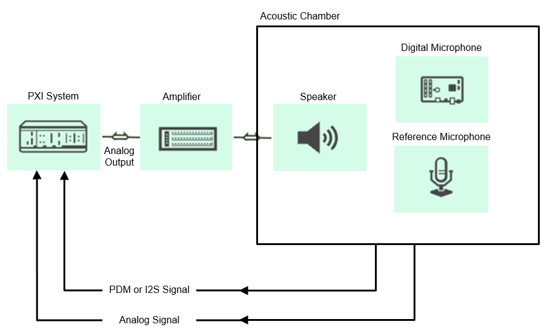

# Digital Microphone Validation

This plug-in performs measurements to validate digital microphones. The system will use a speaker to generate a sound and then acquire data from a digital microphone and a reference microphone.

## Key Features

- Acquires digital microphone data
  - Supports PDM and I2S protocols
- [Calibrate Acoustic Output Level](docs/measurements/calibrate-acoustic-output.md)
- [Single Tone Measurements](docs/measurements/single-tone.md)
- [Frequency Response Measurements](docs/measurements/frequency-reponse.md)

## Hardware Setup

  

Instrumentation:

- NI Dynamic Signal Acquisition and Generation device (PXIe-4468)
- NI PXIe-7820/21
- SMU (such as PXIe-4139)

Tested HW setup:

- NI PXIe-4468
- NI PXIe-7820
- NI PXIe-4139
- [PDM digital microphone](https://learn.adafruit.com/adafruit-pdm-microphone-breakout/) and [I2S digital microphone](https://www.adafruit.com/product/3421)
- GRAS 40PP reference microphone
- USB desktop speaker

## Software Installation

(*This section is if you only want to use the pre-compiled plug-ins. If you want to open the source code, go to [software development](docs/sw-dev.md).*)  
Install from NI Package Manager:

- NI RIO (2024 Q1 or greater)
- NI DAQmx (2024 Q1 or greater)
- NI DCPower (if using NI SMU to power device)
- InstrumentStudio (2024 Q4 or greater)

Download the latest NI package from the releases section of this repo or add the feed to NI Package Manager to get updates from this repo and other in this community. To use the NI Package Manager feeds, refer to this: [Subscribing to package feeds](https://github.com/NI-MeasurementLink-Plug-Ins/package-manager-feeds)

## Contributing

Use the instructions in [software development](docs/sw-dev.md) for setting up a development environment and overview of the code.
