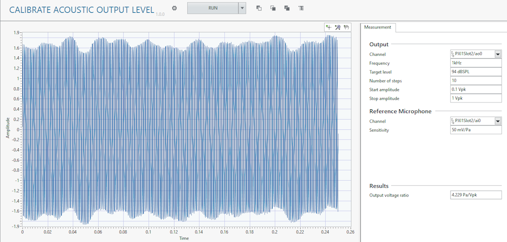

# Calibrate Acoustic Output Level

This plug-in calibrates the acoustic output level of the speaker. It is common to validate microphones at a specific sound level. It is important that the speaker level is calibrated before validation in order to generate the desired sound levels. Many speakers have amplifiers which have a volume control. The volume control will change the output voltage ratio (or scaling) of the speaker. If you adjust the volume control, you should re-calibrate your output level.

## InstrumentStudio panel

### Usage

Select the output frequency and target level that to calibrate the speaker. The plug-in will perform a sweep starting at the start amplitude continuing until the stop amplitude or until the measured sound pressure level is above the target level. The algorithm will determine the **output voltage ratio** of the speaker which will be used in other plug-ins.  

