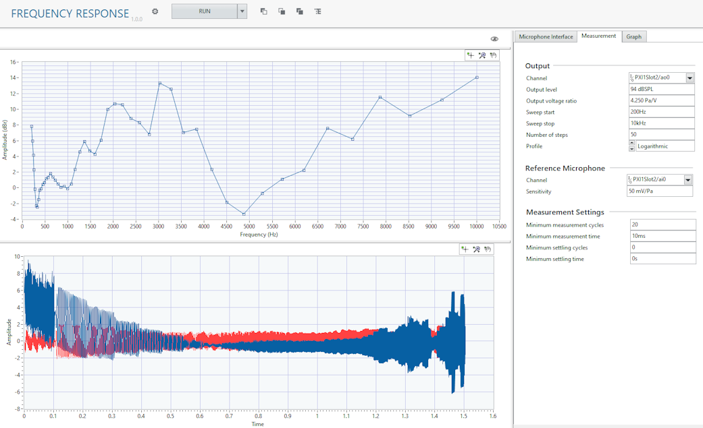

# Frequency Response

This plug-in plays a stepped sine wave through the speaker and measures the response of the digital microphone and a reference microphone. The plug-in computes teh amplitude response and THD and THD+N vs frequency.

## InstrumentStudio panel

### Usage

Enter the desired frequency range and profile of the stepped sine sweep as well as the output level. If you have not calibrated the acoustic output level of the speaker, run the [Calibrate Acoustic Output Level](../measurements/calibrate-acoustic-output.md) plug-in to determine the appropriate output voltage ratio to use.
