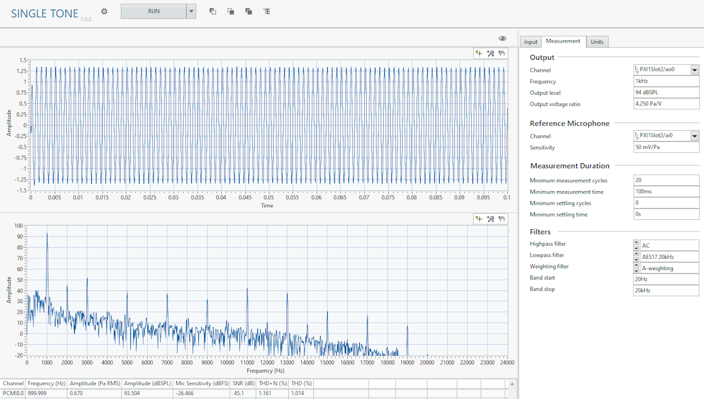

# Single Tone

This plug-in generates a single tone frequency through the speaker and measures the response of the digital and reference microphone. The following measurements are computed from the data:

- Frequency
- Amplitude
- Microphone sensitivity
- SNR
- THD
- THD+N

## InstrumentStudio panel

### Usage

Enter the desired frequency and output level to test the digital microphone. You can use the *minimum settling time* and *minimum settling cycles* to remove any settling from the measurement if the microphone's output takes longer to settle. If you have not calibrated the acoustic output level of the speaker, run the [Calibrate Acoustic Output Level](../measurements/calibrate-acoustic-output.md) plug-in to determine the appropriate output voltage ratio to use.  
