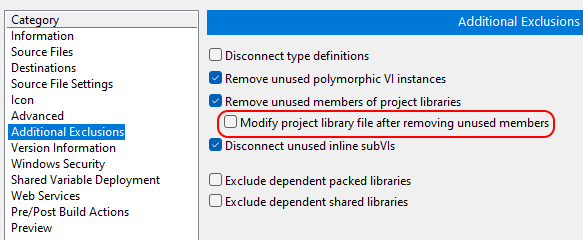

# Setup a Development Environment

If you want to commit changes to the repo, we recommend you use the current versions of application software unless a newer version enables new features. Software should work with newer versions of these dependencies. Unless otherwise noted, software can be downloaded with the [NI Package Manager](https://www.ni.com/en/support/downloads/software-products/download.package-manager.html#322516).

Software dependencies:

- LabVIEW 2022 Q3 64-bit
- InstrumentStudio 2024 Q4
- Sound and Vibration Toolkit 2023 Q3
- Digital Audio Acquisition and Generation Toolkit 2023 Q3
- NI DAQmx (latest)
- NI DCPower (latest)
- NI RIO (latest)

Tested with:

- TestStand 2024 Q4

## Known Issues

There is a known issue with building LabVIEW applications with the Sound and Vibration toolkit. To workaround this issue, copy the Common folder  
from *C:\Program Files\NI\LVAddons\nisvt\1\vi.lib\addons\_NISVFA\_Shared subVIs*  
to *C:\Program Files\National Instruments\LabVIEW 2022\vi.lib\addons\_NISVFA\_Shared* subVIs.  
For more information, refer to [Known issue 2432236](https://www.ni.com/en/support/documentation/bugs/23/labview-sound-and-vibration-toolkit-2023-q3-known-issues.html)

When building an executable which uses the Signal Generation API from the Sound and Vibration toolkit, make sure to uncheck the *Modify project library file after removing unused members* option in the build specification.  

